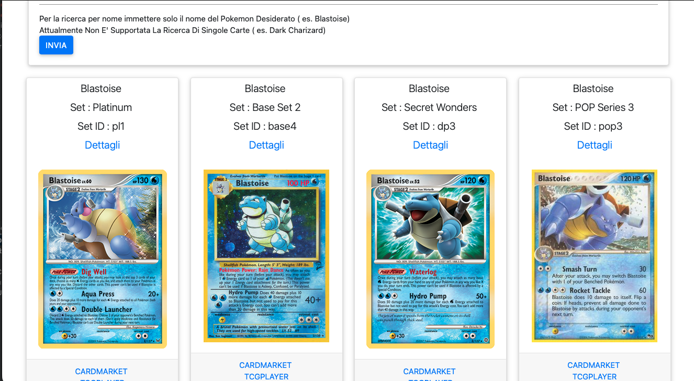

<h1>FEEDBACK WEB APP</h1>

Applicazione realizzata per riunire tutti i feedback delle compravendite online. Inoltre essendo stata pensata per il collezionismo delle carte da collezione pokemon è stata introdotta una sezione apposita per la ricerca delle carte e del loro valore

<h2>REALIZZAZIONE</h2>

L'applicazione è stata realizzata attraverso il framework expressjs (https://expressjs.com) basato su node (https://nodejs.org/). I dati risiedono all'interno di un database MySql.

Per la ricerca e la valutazione delle carte sono state utilizzate le api fornite da https://pokemontcg.io </sapn>

<h2>INSTALLAZIONE E UTILIZZO</h2>

Attualmente l'applicazione risiede sull'host heroku(https://heroku.com/) ed è accessibile a tutti attraverso l'indirizzo https://feedbackwebapp.herokuapp.com.

Il sistema di autenticazione utilizzato dall'applicazione è quello fornito da facebook, in quanto l'idea dell'applicazione è nata dopo il confronto con gli amministratori di varie community di collezionismo pokemon risiedenti all'interno del social network.</sapn>

Una volta effettuato il login l'utente è automaticamente registrato all'interno della piattaforma e potrà effettuare e/o ricevere feedback e andare a ricercare le carte e il loro valore.

NB: Nella pagina principale l'utente non potrà vedere il prorpio profilo, il quale può essere monitorato nella sezione apposità , raggiungibile attraverso il menù ( cliccando sopra la propria immagine e successivamente sul proprio nominattivo)

L'utente potra registrare un feedback (negativo/postivo) riguardo alla compravendita avuta con un utente registrato. Potrà oltre che valutarlo positivamente o negativamente 
registrare una piccola descrizione della trattativa e indicare su quale piattaforma è avvenuta. In questo modo possono essere registrate tutte le trattative avvenute anche su piattaforme diverse da Facebook

Gli utenti possono essere ricercati attraverso la select posta in alto nella home.

E' presente una pagina dedicata alla visualizzazione dei "Top Seller" cioè di coloro che hanno totalizzato il numero maggiore di feedback positivi.

Una funzionalità sicuramente utile e carina è la possibilità di ricercare le carte riguardanti un pokemon, un set o una specifica espansione

<sapn>All'interno del dettaglio della carta è possibile visualizzare i vari valori forniti dai due principali siti utilizzati per le valutazioni, Cardmarket(https://www.cardmarket.com/it/Pokemon) e TCGPLAYER(https://www.tcgplayer.com) 
